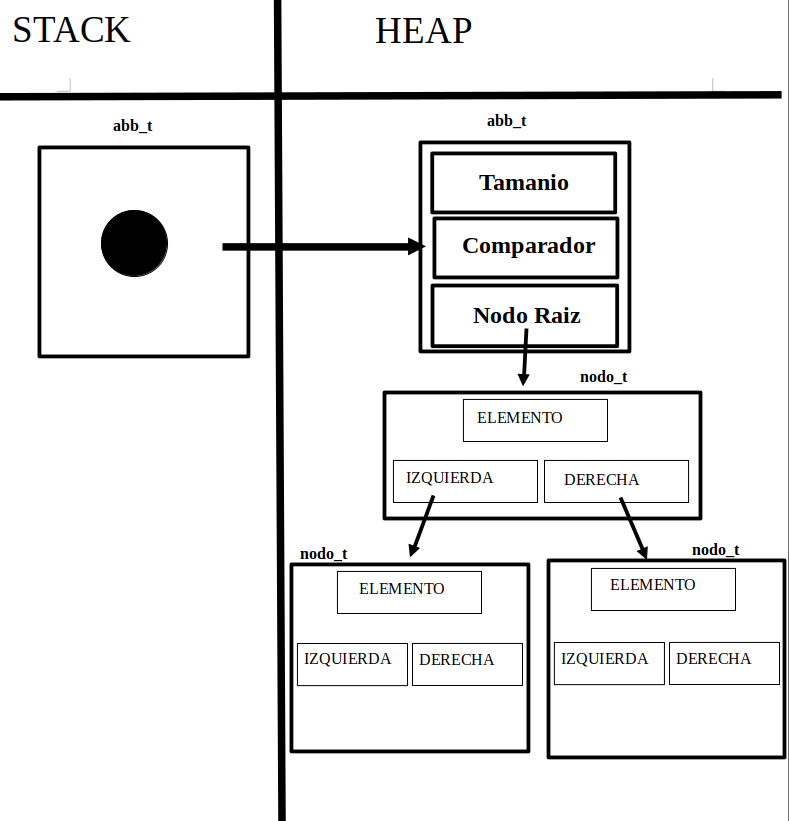

# TDA ABB

## Repositorio de Lautaro Martin Sotelo - 107472 - lmsotelo@fi.uba.ar

- Para compilar:

```bash
make pruebas_chanutron
make pruebas_alumno
make ejemplo
```

- Para ejecutar:

```bash
./pruebas_chanutron
./pruebas_alumno
./ejemplo
```

- Para ejecutar con valgrind:
```bash
make valgrind-chanutron
valgrind ./pruebas_alumno
```
---
##  Funcionamiento

En esta ocacion se implemento un Arbol binario de Busqueda(ABB) , con las funciones primitivas y operaciones que se asocian a este TDA.Los mismos tienen los elementos distribuidos en forma que los menores a la raiz o el padre de cada nivel/rama se ubican a la izquierda, y los superiores del padre a la derecha.Se utilizaron nodos entrelazados que poseen el siguiente estructura:

```c
struct nodo_abb {
	void *elemento;
	struct nodo_abb *izquierda;
	struct nodo_abb *derecha;
}
```
El mismo contiene 3 punteros que apunta 1 al elemento almacenado en el mismo, y los siguientes 2 punteros que tambien son del tipo `nodo_abb` apuntan a los hijos de ese nodo.La estructura del ABB posee un nodo raiz,que es el nodo donde se inicia el ABB , un comparador y tambien un tamanio del mismo:

```c
struct abb {
	nodo_abb_t *nodo_raiz;
	abb_comparador comparador;
	size_t tamanio;
};
```

El comparador es definido por el usuario, el cual recibe dos punteros a elementos , y el mismo se basa en la caracteristica que desea el usuario comparar, ejemplo:

```c
int comparador(void *c1, void *c2)
{
	cosa *cosa1 = c1;
	cosa *cosa2 = c2;
	return cosa1->clave - cosa2->clave;
}
```
El mismo es una caracteristica esencial en el ABB, sin el no se podria recorrer el arbol ni poder llevar a cabo las funciones primitivas u operaciones que posea el ABB, ya que no se podria tener la nocion de la izquierda y derecha de los elementos, desde su raiz a sus hijos y los niveles siguientes.

Las operaciones que posee este TDA son : 

- Crear el ABB.
- Insertar elementos .
- Quitar elementos .
- Buscar elementos.
- Verificar si el mismo esta vacio o no.
- Obtener el tamanio del mismo, es decir, la cantidad de elementos almacenados.
- Recorrer el abb o iterar internamente y aplicar una funcion definida por el usuario.
- Los metodos de recorrer o iterar pueden ser:in orden, pre orden o post orden.

Cabe destacar ciertos puntos ademas del ABB.Por siguiente se destaca que al eliminar un nodo que posea dos hijos, se busca un sustito o el predecesor inorden , el mayor del lado derecho del arbol, con al funcion : 

```c
nodo_abb_t *buscar_predecesor_inorden(nodo_abb_t *nodo)
{
	if (nodo->derecha) {
		return buscar_predecesor_inorden(nodo->derecha);
	}
	return nodo;
}
```
Que como se ve, se comprueba que el nodo tenga un hijo a su derecha, y si es asi seguira de manera recursiva hasta que no hay mas, y por lo tanto retorna el nodo, pero como se dice, en este caso se busca el mayor , pero tambien se puede usar la alternativa de buscar el minimo, es decir, la izquierda.


### Implementacion:

Inicialmente, se utiliza la funcion `abb_crear` el cual reserva memoria en el heap para el ABB e inicializa los valores (Diagrama de inicio) :

<div align="center">

</div>

El mismo tiene un coste de O(1), no depende del tamanio del mismo.Luego podriamos pasar a las funciones `abb_insertar` o `abb_buscar`, ambas correspondientemente si el arbol esta balanceado(determinado con altura subarbol derecho - altura subarbol izquierdo, siempre con valores entre -1,0 y 1) ya que no debe recorrer todos los nodos sino una rama,tendria un costo de O(log(n)), caso contrario y el peor caso de recorrer todos los nodos tendria un coste de O(n).

La funcion `abb_insertar` inserta el nodo con la clave determinada en el parametro de la funcion, se reserva memoria e indica que debe contener.Se utiliza una funcion auxiliar denominada `abb_insertar_nodo` la cual mediante el comparador evalua donde ubicar el nodo.Finalmente se aumenta el tamanio del nodo.

Por otro lado la funcion `abb_buscar` busca a traves de los nodos un elemento que coincida con el pasado por el parametro, para luego retornar el elemento si la coincidencia fue exitosa.Tambien aqui se utiliza una funcion auxiliar `abb_buscar_nodo` , que nuevamente utiliza el comparador para determinar por donde buscar.

Tambien tenemos la funcion `abb_quitar` que en el peor de los casos tiene complejidad O(n), ya que habria que encontrar el elemento y luego verificar quien lo reemplazara, pero si esta balanceado nuevamente seria O(log(n)).La misma quita el nodo del ABB y retorna el elemento o NULL si hay un error.
Asi en todo caso tenemos situaciones en la que si es un nodo hoja, se eliminara normalmente , pero para los hijos, en caso de ser 2 se utilizara el predecesor inorden, y reemplazaria el nodo quitado,caso de 1 hijo,se pone el hijo en el lugar que ocupaba.Siempre reubicando la referencia para asi no perder los elementos.

La funcion `abb_destruir` y `abb_destruir_todo` se encargan de eliminar los datos almacenados en el heap por el ABB, `abb_destruir` destruye el arbol y `abb_destruir_todo` tambien destruye los elementos que se encuentren almacenados con la funcion destructura.En este caso la complejidad es O(n).

Las funciones mas simples tal vez serian `abb_vacio` y `abb_tamanio` ambas tienen complejidad O(1), la primera se encarga de comprobar si se encuentra vacio (siendo un boleano True caso positivo)y la siguiente retorna el tamanio ABB(0 en caso de no haber nada).

Por ultimo y para finalizar las funciones `abb_recorrer` y `abb_con_cada_elemento`, ambas siendo de complejidad O(n),la primera se encarga de recorrer el ABB y almacena en un array con un tamanio ,que no sea 0, los elementos del mismo hasta su capacidad maxima.Mientras que `abb_con_cada_elemento` itera internamente y aplica la funcion determinada en el parametro, que en caso de esta funcion retornar false, se finaliza el recorrido.Ambas funciones pueden recorrer de manera: 
- InOrden:Izquierdo,Centro,Derecha.
- PostOrden:Izquierdo,Derecho,Centro.
- PreOrden:Centro,Izquierda,Derecha.

---

## Respuestas a las preguntas teóricas
- Explique teóricamente qué es una árbol, árbol binario y árbol binario de búsqueda. Explique cómo funcionan, cuáles son sus operaciones básicas (incluyendo el análisis de complejidad de cada una de ellas) y por qué es importante la distinción de cada uno de estos diferentes tipos de árboles. Ayúdese con diagramas para explicar.

### Arbol

Se trata de un conjunto de nodos entrelazados, que contienen un elemento, conectados a un nodo raiz(nodo principal).A partir del mismo se ramifica a otros nodos, niveles.La misma permite organizar los elementos estableciendo una relacion de descendencia entre los elementos que existen (de alli las definiciones de nodo padre/nodo hijos) y son altamente recursivos.

### Arbol Binario

Es un arbol en el que cada nodo posea 2 hijos , un hijo o 0 , proveniendo de alli la definicion de Arbol Binario.Esto permite que exista una particularidad de identificar los elementos a la izquierda o la derecha.Este al desconocerse su estructura o la distribucion de nodos, es de poca utilidad, con ello puede provocar casos en el que actue como una lista enlazada, llevando a complejidades de O(n).

**Operaciones Basicas**

- Creacion
- Insercion
- Eliminacion
- Busqueda
- Verificar Vacio
- Destruccion
- Recorrido

<div align="center">

</div>

### Arbol Binario de Busqueda

El Arbol Binario de Busqueda o abreviadamente ABB, posee las caracteristicas de los Arboles citados anteriormente aprovechando la propiedad esencial que se trata de la relacion de orden entre los elementos con la nocion de izquierda o derecha respecto al nodo padre.
En este caso, se ordenan los elementos menores a la izquierda y los mayores a la derecha.
Con ello, la estructura almacena los elementos en nodos entrelazados sin tener que ser en memoria contigua, y tambien su complejidad es reducida a O(log(n)) porque al saber el ordenamiento de los elementos, se recorre por las ramas especificas sin tener que recorrer todos los nodos,ya que solamente se debe comparar el elemento buscado con el nodo raiz y cada sub arbol.
Por ultimo cabe destacar que siempre posee un comparador, la cual se encarga de comparar los elementos

**Operaciones Basicas**

- Creacion O(1)
- Insercion O(log(n))
- Eliminacion O(log(n))
- Busqueda O(log(n))
- Verificar Vacio O(n)
- Destruccion O(1)
- Recorrido O(n)

<div align="center">

</div>


### Diferencia ABB y Arbol Binario

Por lo tanto, la diferencia esencial entre un ABB y un Arbol Binario es que el ABB es un arbol binario en el que los elementos cumplen y *deben*
con el orden citado anteriormente segun su clave, asi conociendo su estructura y con la misma reduciendo tiempos de complejidad algoritmica, siendo asi realmente eficaz frente a otras estructuras de datos.


---

