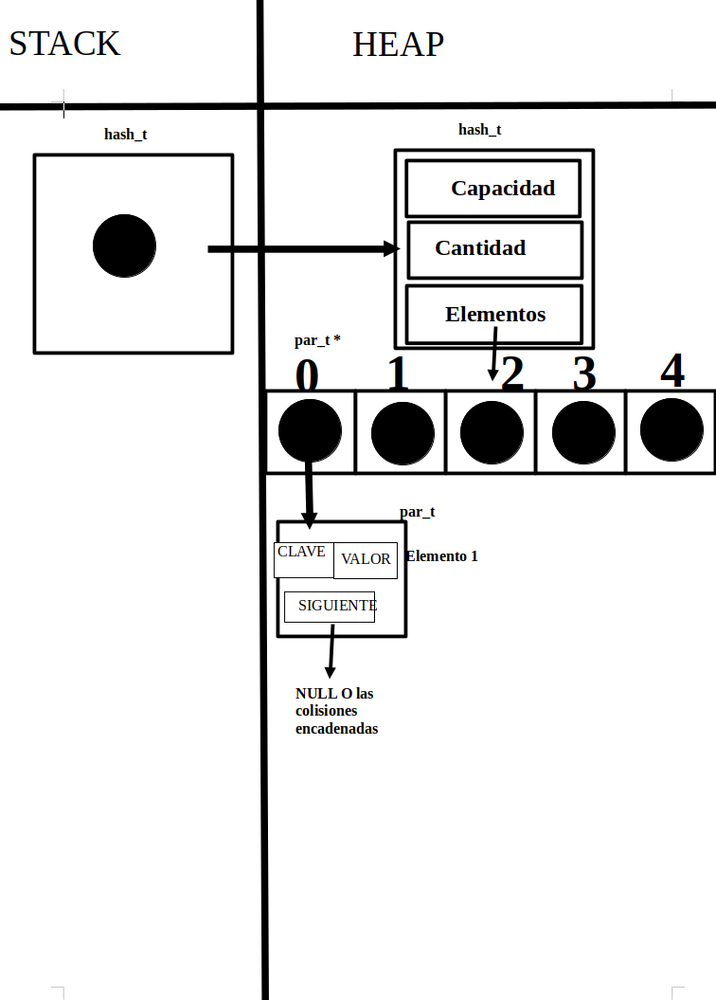
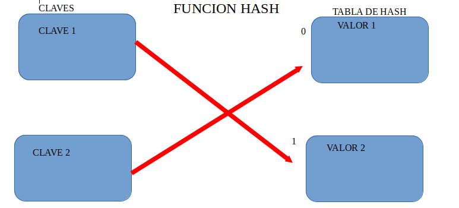
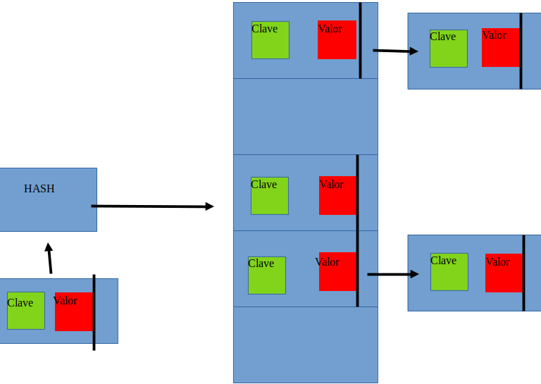
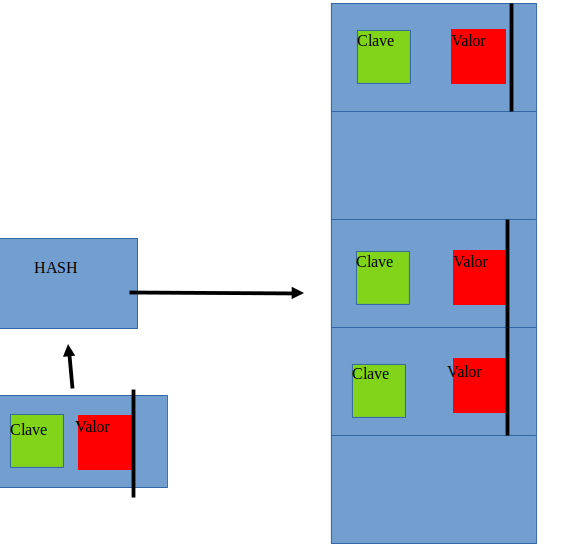

div align="right">

</div>

# TDA HASH

## Repositorio de Lautaro Martin Sotelo - 107472 - lmsotelo@fi.uba.ar

- Para compilar:

```bash
make pruebas_chanutron
make pruebas_alumno
make ejemplo
```

- Para ejecutar:

```bash
./pruebas_chanutron
./pruebas_alumno
./ejemplo
```

- Para ejecutar con valgrind:
```bash
make valgrind-chanutron
valgrind ./pruebas_alumno
```
---
##  Funcionamiento

### Breve introduccion

En esta ocacion se implemento un TDA HASH abierto con direccionamiento cerrado , con las funciones primitivas y operaciones que se asocian a este TDA, el cual se trata de una de las implementaciones mas comunes de diccionario.El mismo permite acceder a elementos en una tabla HASH con complejidad de O(1) asociando las claves un valor numerico indice para poder buscarlo, permitiendo que las funciones de insercion y busqueda sean mas rapidas indiferentemente del tamanio de los datos.

Al tratarse de un diccionario, el mismo almacena los elementos en pares, de manera clave-valor siendo que:
- Clave: un dato unico que se utilizara para indexear los valores.Puede ser de cualquier tipo y la funcion HASH generara un indice a partir del mismo en la tabla.
- Valor: datos asociados de una clave.

Por ello mismo ,se creo la estructura denominada par: 

```c
typedef struct par {
	char *clave;
	void *valor;
	struct par *siguiente;
} par_t;
```
Donde tiene un char que se asocia a la clave, un valor del mismo y un struct par que apunta al siguiente nodo.Su nombre viene deacuerdo a su contenido clave valor.
Mientras que para el HASH se implemento la siguiente estructura:

```c
struct hash {
	size_t capacidad;
	size_t cantidad;
	par_t **elementos;
};

```
El mismo tiene informacion de la capacidad que puede tener, la cantidad que seria el espacio ocupado y un struct par_t elementos de la misma tabla, siendo doble puntero .
Pasando a la parte del funcionamiento del mismo, las operaciones que posee este TDA son:
- Crear el HASH O(1)
- Insertar elementos O(1) O(n) si hay colisiones constantes
- Quitar elementos O(1) O(n) si hay colisiones constantes
- Obtener elemento O(1) O(n) si hay colisiones constantes
- Verificar Si existe contenido O(1) O(n) si hay colisiones constantes
- Recorrer el Hash con un iterador interno O(n)
- Destruir el Hash y sus elementos O(n)


### Implementacion

Inicialmente tenemos a `Hash_crear` funcion que creara el mismo en el stack , reservara su memoria inicializando las variables del mismo.Se tiene en cuenta que debe haber un tamanio minimo , en este caso de 3 para la tabla hash, y si se intenta en de menor tamanio ejemplo 1, se creara de 3 igualmente.
<div align="center">

</div>

Como vemos, se crea en el stack el hash, luego en el heap que se reserva la memoria elementos apuntara a un puntero par_T que apuntara a elementos par_T que se almacenan en el heap, que contienen informacion clave , valor y un puntero siguiente que guardara en la lista si ocurre una colision en esa posicion de la tabla hash al tratarse de una tabla hash abierta con direccionamiento cerrado.Por lo tanto, primero deberiamos insertar elemenos , alli `Hash_insertar` Inserta o actualiza un elemento en el hash asociado a la clave dada.El mismo reserva memoria ,guardando el elemento y copiando la clave a otra direccion de memoria antes de guardarla.Alli entra la `funcion hash` para obtener la posicion, y si esta vacia colocar el par ahi o sino es asi iterara hasta encontrar un duplicado o el final.
```c
size_t djb2(const char *str)
{
	size_t hash = 5381;
	int c;
	//Va a recorrer los caracteres de la cadena y calcula el hasg
	while ((c = (int)*str++))
		hash = ((hash << 5) + hash) + (size_t)c; /* hash * 33 + c */

	//retorna el valor final del hash
	return hash;
}
```
Teniendo en cuenta que si se pasa del factor de carga se realizara un rehash, el cual verifica primero que el hash inicial no es null, crea un nuevo hash `rehash` con el doble de capacidad original mas uno, hace un swap entre el hash original y el rehash con ayuda de un auxiliar, para luego destruir el rehash una vez ya sus elementos transferidos al hash original y retornar el hash original, modificado y con su capacidad aumentada.
```c
hash_t *funcion_rehash(hash_t *hash)
{
	if (!hash) {
		return NULL;
	}
	hash_t *rehash = hash_crear(hash->capacidad * 2 + 1); // aqui se modifica el tamanio + 1 del inicial
	if (!rehash) {
		return NULL;
	}
	for (size_t i = 0; i < hash->capacidad; i++) {
		for (par_t *par = hash->elementos[i]; par;
		     par = par->siguiente) {
			hash_insertar(rehash, par->clave, par->valor, NULL); // se inserta cada elemento del hash original en el nuevo
		}
	}
	hash_t aux = *hash; // se intercambian los hashes.
	*hash = *rehash;
	*rehash = aux;
	hash_destruir(rehash); // se borra ya que no es mas necesario
	return hash;
}
```
Luego tenemos `Hash_obtener`, el cual va a la posicion del vector que le indique el hash de la clave recibida , e itera la lista enlazada em esa posicion hasta que encuentre un elemento con la misma clave o en cuentre NULL, que indicaria su final, que indicaria que no se encontro la clave especificada.`Hash_contiene` tiene el mismo funcionamiento , con la diferencia que retornara un boleano, ambas por mismo motivo en similitud decidi crear una funcion auxiliar que resuma las dos en 1 sola funcion.

```c
par_t *buscar_clave_en_hash(hash_t *hash, const char *clave)
{
	if (!hash || !clave)
		return NULL;

	size_t pos = djb2(clave) % hash->capacidad;
	par_t *par = hash->elementos[pos];

	while (par != NULL) {
		if (strcmp(clave, par->clave) == 0) {
			return par;
		}
		par = par->siguiente;
	}
	return NULL;
}

void *hash_obtener(hash_t *hash, const char *clave)
{
	if (!hash || !clave)
		return NULL;
	par_t *par = buscar_clave_en_hash(hash, clave);
	return par ? par->valor : NULL;
}

bool hash_contiene(hash_t *hash, const char *clave)
{
	if (!hash || !clave)
		return NULL;
	return buscar_clave_en_hash(hash, clave) != NULL;
}
```

Basicamente buscar_clave_en_hash usara la funcion djb2 para obtener la posicion, luego strcmp verificara si coincide con la igualdad a = 0 y en caso positivo retornara el par clave valor, sino sera siguiente hasta que finalize.Siempre verificando que los punteros pasados no sean `NULL`.
Luego tendriamos `Hash_Quitar` el cual, se encarga de retirar elementos de la tabla de acuerdo a una clave dada.Buscara la clave dentro de la misma y si enecuentra liberara la memoeria reservada en la misma y su elemento, para reducir su cantidad en 1.
Otra funcion y tal vez la mas simple seria `Hash_cantidad` el cual retorna la cantidad de elementos , y no la capacidad, que posee la tabla hash.
Por el otro lado entrarian las funciones `Hash_destruir` y `Hash_destruir_todo` donde la primera utiliza la segunda para liberar la memoria reservada por el clash, incluyendo sus elementos.Para ello recorrer cada una de las posiciones de elementos `hash->elementos` del hash, y en cada posicion itera sobre la lista enlazada de elemetos `par_t` , para cada elemento se le aplicara una funcion destructura segun especifique el usuario y se liberaran las memorias relacionadas a la `clave` y  elemento `par_T` .Finalmente los punteros se nulifican (`hash->elementos[i]` como NULL) y una vez iterado sobre el mismo se liberara la memoria de elementos, y de hash correspondientemente.
Finalmente tendriamos el iterador interno `hash_con_cada_clave` que se encarga de recorrer los elementos del hash y contar los mismos, mismo depende de la funcion pasada por el usuario como parametro, hasta que la funcion retorne `false` , retornando la cantidad de veces que la funcion fue ejecutada sobre los elementos del hash.

---


## Respuestas a las preguntas teóricas
   - ### Qué es un diccionario
   Como se digo anteriormente, un diccionario es una coleccion de pares `clave` ,`valor` asociados, una clave para buscar su contenido, valor almacenado, siendo que todos los elementos tienen un identificador, por lo tanto tenemos estas caracteristicas:

   - Asociacion clave-valor.
   - Acceso eficiente.
   - Estructura dinamica, que varia de acuerdo a la insercion o eliminacion de elementos.
   - Diversas formas de implementacion con arboles listas etc, segun los requerimientos deseados.
    Pero como se dijo anteriormente, el acceso rapido a esas claves se debe a un proceso, el cual es las funciones de hash.

   - ### Qué es una función de hash y qué características debe tener

   La funcion hash permite tomar una variable de datos de entrada y devuelve un valor , indice que indica su posicion de manera unica, denominandose este proceso hashing. La misma debe ser eficientemente computable, distribuir uniformemente las claves y la misma clave debe devolver los mismos valores.Paracrear funciones hash, se asigna una clave a una de los indices de la tabla tomando el resto de la clave dividida por el tamaño de la tabla. Por lo tanto quedaria como `h(k)=k%mh(k) = k \% mh(k)=k%m`.
   La ventaja del método del modulo es que el hash siempre va a ser menor igual a m.
   Ejemplo de una funcion hash que transforma la clave en un numero asociado,indice y su valor.
    <div align="center">
    
    </div>

   - ### Qué es una tabla de Hash y los diferentes métodos de resolución de colisiones vistos (encadenamiento, probing, zona de desborde)

Como se vio en el diagrama anterior, ya se pudo visualizar lo que es la tabla hash.La misma se crea de acuerdo a lo que se desee en la cantidad de datos a almacenar.Y en vez de insertar cada elemento de la tabla en orden, se le asigna una clave con la funcion citada anteriormente, y su posicion sera el valor que retorne, para asi guardar ese elemento en la tabla.Asi guardaremos el par `clave-valor`,para luego si queremos buscar sus elementos , solo usaremos su clave y con la funcion hash vamos al indice de la tabla.Todo esto prova que las operaciones sean O(1) pero con un mal que puede pasar, las colisiones en el hash.Esto debido a que existen muchas claves posibles, pero los valores que puede devolveer la funcion hash son pocos a diferencia, y a mayor tiempo esto puede llegar a provocar colisiones de repeticion en el valor de hash, y provoque que vayan en la misma posicion del vector.Para solucionar estos problemas se recure al `Hash abierto de direccionamiento cerrado`, el cual consiste en guardar todos los elementos con el mismo hash en la misma posicion, o `Hash cerrado de direccionamiento abierto`,contrariamente, guardarlos en otra posicion distinta.

Con el hash abierto , debere recorrer la lista enlazada para encontrar la clave son su valor, `la resolucion por encadenamiento`.Siendo k un indicie para varios elementos, conteniendo un puntero inicial de la lista de elementos, y si no hay elementos, contiene NULL.Su complejidad dependera si la funcion hash `esta bien o mal implementada ` , provocando que en el peor de los casos sea la de una lista enlazada O(n) para insertar , eliminar o buscar elementos en el mismo.Este fue el metodo utilizado en el TP.A continuacion unos diagramas conceptuales:

### Hash abierto

<div align="center">

</div>


A diferencia de la resolucion por encadenamiento , en el direccionamiento abierto no se alamacena varios elementos en un indice, sino que solo una clave o con valor NULL.El mismo puede tener varios metodos para resolver colisiones: 

- `Probing lineal` : se busca el espacio libre inmediato.
- `Probing cuadratico` : debe haber 2 veces intentos fallidos para insertar
- `Hash doble` : aplica una segunda funcion hash a la clave cuando hay colision.

Por ultimo tenemos la `zona de desborde`, el cual seria asignar una zona especifa de la tabla para elementos que hayan colisionado, cuyo tamanio es predefinido en funcion del tamanio de total de la tabla.En el mismo se insertan los elementos de acuerdo a su orden de llegada.
Este tipo de hash puede provocar problemas al borrar elementos, no se encuentre el mismo debido a una colision y se coloque en una posicion que no debe, simplemente solucionandose con agregar una `flag` de borrado, si es asi sigue buscando,

### Hash cerrado

<div align="center">

</div>

Por lo tanto tenemos en conclusion las siguientes diferencias:

- El direccionamiento abierto requiere mas valor matematico, mientras que el encadenamiento es mas simple.
- El encadenamiento nunca se llenara al agregar varios elementos en un mismo indice, pero en el direccionamiento abierto se puede llenar.
- El encadenamiento desperdicia espacio, mientras que en el abierto no y se utiliza una celda incluso si una entrada no se asigno a la misma.
- En el direccionamiento abierto se conoce la frecuenta y numero de claves, mientras que en el encadenamiento no.
- El direccionamiento abierto requiere evitar la agrupaacion y el factor de carga desfavorable, mientras que el encadenamiento su efecto es menor.