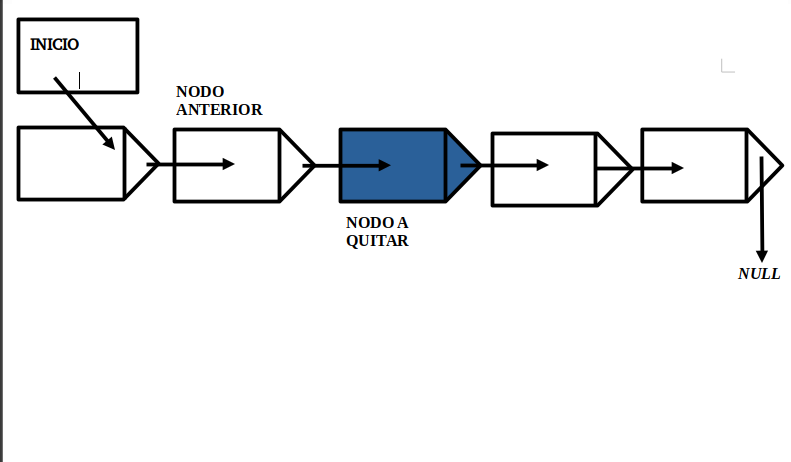

<div align="right">

</div>

# TDA LISTA ALGORITMOS 2 MENDEZ

## Repositorio de Lautaro Martin Sotelo - 107472 - lmsotelo@fi.uba.ar

- Para compilar:

```bash
make pruebas_chanutron
make pruebas_alumno
make ejemplo
```

- Para ejecutar:

```bash
./pruebas_chanutron
./pruebas_alumno
./ejemplo
```

- Para ejecutar con valgrind:
```bash
make valgrind-chanutron
valgrind ./pruebas_alumno
```
---
##  Funcionamiento

**En resumen** y para el funcionamiento principal se implementa un archivo `lista.c` con la funcinoes declaradas en `lista.h`, con caracteristicas y funcionalidad que tiene un **TDA Lista**, el mismo , se encuentra utilizando para esta ocasion nodos simplemente enlazados (como se pide en la implementacion) y para su iteracion se crearon un iterador interno y externo para el mismo.Una vez finalizada la implementacion, se reutilizo para implementar los otros 2 TDAS , correspondientemente **TDA Pila** y **TDA Cola**.

### Lista de nodos simplemente enlazada:

<div align="center">

</div>


Particularmente los nodos utilizados poseen un elemento que pueden ser **contenido que puede variar y puede ser NULL** y con un puntero que apunta al siguiente nodo, referenciandolo.


### A continuacion se detalla los structs definidos

Por lo tanto el struct de nodo se define:

```c
 typedef struct nodo {
	void *elemento;
	struct nodo *siguiente;
} nodo_t;

```
Con `elemento` siendo el contenido y el puntero `nodo *siguiente` el nodo que le sigue.

La lista por lo tanto se recorre a traves de estos nodos, su estructura se define de tal manera: 

```c
struct lista {
	nodo_t *nodo_inicio;
	nodo_t *nodo_fin;
	size_t cantidad;
};

```
Con `nodo_inicio` referenciando al primer nodo, `nodo_fin` al ultimo y `cantidad` a la cantidad de nodos que posee la lista.

Por ultimo el iterador externo se define : 

```c
struct lista_iterador {
	nodo_t *nodo_iterador;
	lista_t *lista;
};
```
Siendo con un puntero `*lista` que se referencia a la lista que se busca iterar y `*nodo_iterador` el nodo el cual se encuentra parado.

Antes de detallar mas en profundidad , detallare la funcionalidad completa de `lista.c`, lo que es y finalidad, para luego determinar la `pila` y la `cola`.

### Funcionalidad de lista.c

*lista_crear* : reserva memoria para crear la lista,en caso de dar error retornara NULL e inicializa valores.
```c
lista_t *lista_crear()
{
	lista_t *lista = calloc(1, sizeof(lista_t));
	if (!lista) {
		return NULL;
	}
	lista->nodo_inicio = NULL;
	lista->nodo_fin = NULL;
	lista->cantidad = 0;
	return lista;
}
```
*lista_insertar*: funcion que se encarga de insertar elementos en la misma.Comprueba que exista la lista y crea un nodo reservando memoria en el heap, y comprueba si primero se trata de estar vacia, lo agregara al elemento en `nodo_inicio` , y si se encuentran elementos , se agregan en `nodo_fin`, aumentando su cantidad al final del proceso y retornando la lista.
```c
if (!lista->nodo_inicio) {
		lista->nodo_inicio = nuevo_nodo;
	} else {
		lista->nodo_fin->siguiente = nuevo_nodo;
	}
    lista->nodo_fin = nuevo_nodo;
	lista->cantidad++;
```
*lista_insertar_en_posicion*: similar a `lista_insertar` con la diferencia que se determina la posicion donde el usuario desea ingresar el elemento.Para ello se determina si la posicion es 0, se arega al principio de la lista, ya que corresponde al inicio, y se utiliza un nodo auxiliar que referenciara al anterior y asi no perder su referencia en el heap
```c
else if (posicion == (size_t)0) {
		nuevo_nodo->siguiente = lista->nodo_inicio;
		lista->nodo_inicio = nuevo_nodo;
```
Siendo que se referencia en `nuevo_nodo->siguiente` al nodo inicial.
En caso de ser mayor a la cantidad que posea la lista se agregara al final y se reutiliza la funcion `lista_insertar`:

```c
if (posicion >= lista->cantidad) {
		free(nuevo_nodo);
		return lista_insertar(lista, elemento);
	}
```
Se libera ese nodo porque no sera necesario, y lista insertar al no tratarse de inicio, directamente lo agregara al final.Por ultimo si no se trata ni del inicio ni del final o mas del final, sino en el medio de la lista, se utiliza la funcion `buscar_nodo` .

```c
nodo_t *buscar_nodo(nodo_t *nodo_buscado, size_t posicion_buscada)
{
	if (!nodo_buscado->siguiente || (posicion_buscada == 0)) {
		return nodo_buscado;
	}
	return buscar_nodo(nodo_buscado->siguiente, posicion_buscada - 1);
}

```
Funcion que cumple la funcion de buscar el nodo en la lista, recibiendo el nodo y la posicion que el usuario busca, y devuelve el nodo en la poscion que se busca, y caso contrario se devuelve el ultimo nodo.Se trata de una funcion recursiva ya que posicion ira reduciendose hasta 0, y nodo_buscado , al pasarse como el primer nodo , ira iterando y tomando el valor del nodo siguiente. Por lo tanto en el else: 
```c
else {
		nodo_t *anterior_nodo =
			buscar_nodo(lista->nodo_inicio, posicion - 1);
		nuevo_nodo->siguiente = anterior_nodo->siguiente;
		anterior_nodo->siguiente = nuevo_nodo;
	}
```
Siendo que anterior nodo referencia al nodo anterior al buscado(el puntero siguiente referencia al que se busca) y por lo tanto no se pierde el nodo anterior, y se consigue el buscado.

*Diagrama del proceso:*

### 1)

Se itera hasta una posicion antes donde se quiere insertar el nodo, el nodo aux apunta donde se quiere insertar.

<div align="center">

</div>

### 2)

El nodo anterior deja de apuntar al nodo original y apunta al nodo auxiliar, que se encuentra ya apuntando al nodo original.

<div align="center">

</div>

### 3)

El nodo ya se encuentra en la posicion deseada, formando parte de la lista.

<div align="center">

</div>


*lista_quitar*:Quita siempre el ultimo elemento de la lista, y libera la memoria en el heap que haya ocupado.Retorna el elemento que se ha eliminado,reduce su tamanio , y si encuentra un error retorna NULL.

*lista_quitar_de_posicion*:Es similar a lista_quitar , pero como tambien lo es con `lista_insertar_en_posicion` , inserta en la posicion que el usuario lo determine,y teniendo un similar funcionamiento.
Para ello se entienden y contemplan varias situaciones, si la posicion es mayor a la cantidad o tamanio de la lista, se entiende que es el ultimo y se llamara a `lista_quitar` ya que elimina el ultimo.En caso de ser la posicion 0, se utiliza un auxiliar nodo,como tambien para cualquier otra posicion que este en el medio, utilizando la funcion `buscar_nodo`.Finalmente se libera la memoria del heap.

```c
if (posicion == 0) {
		nodo_t *elemento_eliminado = lista->nodo_inicio->elemento;
		nodo_t *nodo_eliminado = lista->nodo_inicio;
		lista->nodo_inicio = nodo_eliminado->siguiente;
		free(nodo_eliminado);
		lista->cantidad--;
		return elemento_eliminado;
	} else if (posicion >= lista->cantidad - 1) {
		return lista_quitar(lista);
	}
	nodo_t *nodo_anterior = buscar_nodo(lista->nodo_inicio, posicion - 1);
	nodo_t *nodo_eliminado = nodo_anterior->siguiente;
	nodo_t *elemento_eliminado = nodo_eliminado->elemento;
	nodo_anterior->siguiente = nodo_eliminado->siguiente;
	free(nodo_eliminado);
	lista->cantidad--;
```

*Diagrama del proceso:*

### 1)

Se utiliza la funcion `buscar_nodo` , se encuentra el nodo que se busca eliminar, y se referencia al anterior.

<div align="center">

</div>

### 2)

El nodo anterior referencia al siguiente del que se busca eliminar.Es decir, 2 posiciones despues.

<div align="center">

</div>

### 3)

Se libera la memoria del nodo que el usuario determino a eliminar, la lista modifica su tamanio y se reduce en 1.

<div align="center">

</div>

*lista_elemento_en_posicion*:utilizando la funcion `buscar_nodo`, se pasa por parametro la posicion con el elemento que se desea buscar, y retorna el elemento buscado en dicha posicion.

*lista_destruir*:libera la memoria ocupada en el heap,utilizando nuevamente `lista_quitar_de_posicion` cuando la cantidad de elementos es mayor a 0.

*lista_destruir_todo*: similar a la citada previamente, pero aplica una funcion destructura a cada elemento de la lista.

### Iteradores de la lista:

Otras funcionalidades que posee la lista son las que provienen de sus iteradores, por un lado tenemos el iterador interno, funcion que recorre la lista para , aplicar en todo caso, una operacion sobre dichos elementos, en este caso la funcion encargada es `lista_con_cada_elemento`

```c
size_t lista_con_cada_elemento(lista_t *lista, bool (*funcion)(void *, void *),
			       void *contexto)
{
	if (!lista) {
		return 0;
	}
	if (!funcion) {
		return 0;
	}
	size_t contador = 0;
	nodo_t *nodo_actual = lista->nodo_inicio;
	bool continuar = true;
	while ((nodo_actual) && (continuar)) {
		continuar = funcion(nodo_actual->elemento, contexto);
		nodo_actual = nodo_actual->siguiente;
		contador++;
	}
	return contador;
}
```

Dicha funcion devuelve la cantidad de elementos iterados en contador, y utiliza la `f` determinada por el usuario , como valor booleano, para continuar iterando, es decir, aparte de tener una condicion de corte que son los nodos de la lista, hay una condicion que podra ponerse segun lo determine esa otra funcion. En la general un iterador interno resulta de un costo computacional mayor ya que no se controla el ciclo con el que se recorre. Para ello y por eso entra el iterador externo.

Como se determino el struct anteriormente del iterador externo, el mismo es un TDA que recibe una lista no vacia y un nodo que referencia al que se quiere acceder con sus primitivas propias, las funcionalidades del iterador externo son:

*lista_iterador_crear:* Crea un iterador para una lista. Valido hasta que no haya mas elementos en la lista,y devuelve el primer elemento en el cual se encuentre parado.

```c
lista_iterador_t *iterador = calloc(1, sizeof(lista_iterador_t));
	if (!iterador)
		return NULL;
	iterador->lista = lista;
	if (!lista_vacia(lista)) {
		iterador->nodo_iterador = lista->nodo_inicio;
	}
	return iterador;
```
Se guarda la lista, y se guarda en el nodo el primer elemento de la lista.

*lista_iterador_tiene_siguiente:*cumple la tarea de verificar(retornando TRUE o FALSE) si hay elementos por los cuales iterar mediante el puntero `siguiente` propio del nodo.

*lista_iterador_avanzar:*avanza el iterador al siguiente elemento, tambien mediante TRUE o FALSE ,se retorna si pudo avanzar o que no haya mas elementos, para finalmente llamar a `lista_iterador_elemento_actual` cuando sea el ultimo elemento, el resultado sera NULL.

*lista_iterador_elemento_actual:* retorna el elemento en el cual se encuentra posicionado el iterador, o NULL si no existe el mismo.

*lista_iterador_destruir:* funcion que finalmente libera la memoria ocupada en el heap por el iterador.

Con ello, se finaliza las funcionalidades de la lista, que seran utilizadas en los siguientes TDA.

### TDA PILA

La implementacion de la pila , utilizando las funciones de lista, en este caso siguiendo la logica de la pila LIFO(last in, first out) que refiere a que el ultimo elemento que entra sera el primero en salir, tiene dos funciones principales:
`pila_apilar`:pone un elemento en el "tope" de la pila.Utilizando *lista_insertar_en_posicion* de la funcionalidades de lista,
`pila_desapilar`:elimina un elemento en el "tope" de la pila.Utilizando *lista_quitar_de_posicion* de las funcionalidades de lista.
Tambien se utiliza `pila_crear` el cual crea la pila, con la funcion *lista_crear* de lista.COmo otras funciones como `pila_tope`,devuelve el tope de la pila , `pila_tamanio` ,que devuelve em tamanio del mismo o `pila_vacia` que verifica si esta vacia o no.
Por ultimo `pila_destruir` libera la memoria de la pila.

### TDA COLA

La implementacion de la cola, utilizando las funciones de lista, sigue un caso contrario a la pila, el cual sigue la logida de FIFO(first in, first out) el cual, el primer elemento que entro sera el primero en salir, con ello las funciones principales:
`cola_encolar`:pone un elemento en la cola.Utilizando *lista_insertar* de la funcionalidades de lista,
`cola_desencolar`:elimina un elemento de la cola .Utilizando *lista_quitar_de_posicion* de las funcionalidades de lista.
Tambien se utiliza `cola_crear` el cual crea la cola, con la funcion *lista_crear* de lista.Como otras funciones como `cola_frente`,devuelve el primero de la cola , `cola_tamanio` ,que devuelve el tamanio del mismo o `cola_vacia` que verifica si esta vacia o no.
Por ultimo `cola_destruir` libera la memoria de la cola.

Para finalizar, cabe destacar que todas las pruebas realizadas se encuentran cargadas en `pruebas_alumnos.c` donde se encuentran las diferentes pruebas que se llevaron a cabo para verificar diferentes situaciones y casos de error.

---

## Respuestas a las preguntas teóricas
 - *¿Qué es una lista/pila/cola? Explicar con diagramas.*

## Operaciones y funciones basicas de la lista:

- Crear lista.
- Insertar un elemento.
- Eliminar un elemento.
- Verificar si está vacía.
- Ver elemento de la lista.
- Conseguir cantidad de elementos de la lista.
- Destruir lista.

<div align="center">

</div>

 Un TDA lista agrupa elementos que que poseen un sucesor o un predecesor, exceptuando el primero y el ultimo elemento respectivamente, con diversas operaciones que permiten agregar, quitar, eliminar , ver , elementos en la misma, como tambien crear o destruir la propia lista.La misma tiene 3 tipos de listas, la simplemente enlazada que es la utilizada en el TP,la doblemente enlazada(que refenrencia con un puntero al nodo siguente y con otro al anterior,siendo bidireccional) o la circular(que pueden ser simplemente enlazadas, o doblemente enlazadas, y tienen la particularidad que el ultimo elemento apunta al primero de la lista).Esta permite agregar , a diferencia de las siguientes dos, elementos en una posicion que queramos, similar a borrar donde queramos.

## Operaciones y funciones basicas de una pila:

- Crear pila.
- Apilar un elemento (*push*).
- Desapilar un elemento (*pop*).
- Ver tope (ultimo elemento de la pila).
- Verificar si esta vacia.
- Destruir pila.

<div align="center">

</div>

La pila es un TDA que agrupa elementos,que posee las mismas operaciones que la lista pero aplicando la logica de LIFO(last in, first out) que refiere a que el ultimo elemento que entra sera el primero en salir, tiene dos funciones principales:
`push`:pone un elemento en el "tope" de la pila.
`pop`:elimina un elemento en el "tope" de la pila.

## Operaciones y funciones basicas de la cola:

- Crear cola.
- Encolar un elemento (*enqueue*).
- Desencolar un elemento (*dequeue*).
- Ver primer elemento.
- Verificar si está vacía.
- Destruir cola.

<div align="center">

</div>

La cola es un TDA que sigue la logica de FIFO(firt in, first out) que refiere a que el primer elemento que entra sera el primero en salir, tiene dos funciones principales:
`enqueue`:pone un elemento en el "final" de la cola.
`dequeue`:elimina el "primer" elemento de la cola.

 - Explica y analiza las diferencias de complejidad entre las implementaciones de lista simplemente enlazada, doblemente enlazada y vector dinámico para las operaciones:
   - Insertar/obtener/eliminar al inicio

   *Simplemente enlazada:*Al agregarse solamente 1 elemento no se itera n veces. Inicialmente su complejidad seria O(1) para las 3 tareas.

   *Doblemente enlazada:*Similar a simplemente enlazada, pero con un puntero refereciando al anterior, su complejidad deberia ser O(1) tambien para las 3 tareas.

   *vector dinamico:* En el mejor de los casos O(1) para las tres situaciones, pero en el caso que haya elementos se debe redimensionar el vector y tendria una operacion O(n).

   - Insertar/obtener/eliminar al final

   *Simplemente enlazada:*Para eliminar y para obtener sobre la lista se tiene que iterar, por lo tanto seria O(n).Seria O(n) para insertar un elemento al final

   *Doblemente enlazada:*Tambien deberia ser similar a simplemente enlazada, pero la iteracion deberia ser mas eficaz en situaciones.Para insertar deberia ser O(n) , para obtener deberia ser O(n) y para eliminar tambien O(n).

   *vector dinamico:* Seria O(1) para eliminar, una vez eliminado el elemento final se debe redimensionar.O(1) para insertar al final y O(1) para obtener.

   - Insertar/obtener/eliminar al medio

   *Simplemente enlazada:*Debido a que debe iterar sobre la lista para buscar la posicion buscada, la complejidad seria O(n),para insertar tambien deberia ser O(n) siempre, ya que se itera para buscar donde se desea insertar y lo mismo si se busca eliminar en el medio utilizando un auxiliar.

   *Doblemente enlazada:*Nuevamente similar a simplemente enlazada con algo mas de eficacia, su complejidad seria O(n) para los 3 casos.

   *vector dinamico:*Insertar en una posicion arbitraria deberia ser O(n) , eliminar deberia ser O(n) mas el redimensionar y ocupar el espacio borrado en el vector, y obtener deberia ser O(n).

 - Explica la complejidad de las operaciones implementadas en tu trabajo para la pila y la cola.

La pila para apilar con la funcion `pila_apilar` tiene una complejidad de O(1) (*push*) para desapilar con la funcion `pila_desapilar` tiene complejidad de O(1) (*pop*) , para crear seria O(1) y para destruir seria O(n) ya que se debe destruir cada uno de su contenidos.Sus operaciones basicas como lo son apilar o desapilar todas tienen O(1) , se ejecutan en timepo constante sin importar cuandos elementos haya en las mismas..Cola tambien posee las mismas caracteristicas, para insertar seria O(1) y para borrar seria O(1) en sus tareas
`cola_encolar` y `cola_desencolar` respectivamente, y O(n) para destruir junto a O(1) para construir.

## Por lo tanto quedaria asi:

<div align="center">

</div>
