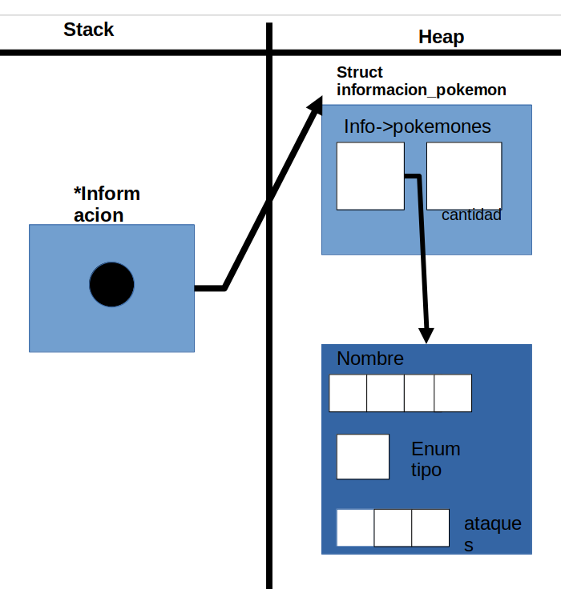

<div align="right">

</div>

# TP1 ALGORITMOS 2 MENDEZ

## Repositorio de Lautaro Martin Sotelo - 107472 - lmsotelo@fi.uba.ar

- Para compilar:

```bash
make pruebas_chanutron
```

- Para ejecutar:

```bash
./pruebas_chanutron
```

- Para ejecutar con valgrind:
```bash
make valgrind-chanutron
```
---
##  Funcionamiento

El TP tiene como funcion principal la implementacion de una funcion determinada para la lectura de archivos y conseguir los datos del mismo, almacenarlos en en el heap mediante un puntero.Esto se lleva a cabo mediante la funcion llamada :

```
informacion_pokemon_t *pokemon_cargar_archivo(const char *path);
```
La misma recibe un puntero con el destino donde se ubica el archivo, verificandose en la funcion que el mismo no sea NULL .En la misma se trabajaran con con los structs siguientes :

```
struct pokemon {
	char nombre[20];
	enum TIPO tipo;
	struct ataque ataque_pokemon[MAX_ATAQUES];
};

struct info_pokemon {
	pokemon_t *pokemones;
	int cantidad;
};
```
La funcion por lo tanto, al verificar que los datos no sean NULL , inicializara con malloc una variable `info_pokemon`, verificando que no sea NULL y tambien el vector de `pokemon` , con `cantidad` en 0.

<div align="center">

</div>

a partir de ello se abrira el archivo mediante `fopen` tambien siempre y cuando no sea NULL, este correctamente abierto y utilizando `fclose` para cerrarlo.Asi pasando las validaciones se leera las lineas del mismo para conseguir los datos y almacenarlos.

```
void leer_linea(FILE *archivo, informacion_pokemon_t *pokemon_lista,
		int *validar)
```
Dicha funcion recibiendo ya los datos correctos y validados, recibe un int validar, que servira para saber si el contenido del mismo tambien cumple con las indicaciones deseadas.

Esta funcion de mano propia, leera linea por linea mediante `fgets` mediante un ciclo while que iterara hasta el final del archivo o que alguna de las validaciones no se cumplas como que no se cumplan 3 ataques por pokemon, o no haya un formato valido.
Con ello obtengo los datos de la linea con `sscanf` igualado a una variable int , diviendo la tarea en otras 2 funciones auxiliares que actuan de acuerdo a la cantidad de elementos leidos. `caso_2_datos` para cuando se trate de un pokemon y `caso_3_datos` para un ataque.
La funcion `caso_2_datos` recibe los datos y la lista, guarda los datos en un `struct pokemon_t `auxiliar y con `realloc` se aumenta el espacio en 1 y siempre y cuando no sea NULL se guardaran los datos, mientras que la funcion `caso_3_datos` accede al vector de ataque dentro del vector dinamico y guardara los datos obtenidos alli.

Para la validacion correspondiente de saber si se cumplia la cantidad de ataques, se utilizo un contador auxiliar, que contaria linea por linea , si cada 4 lineas paso almenos 3 veces por la funcion `caso_3_datos` y los datos eran correctos, implicaria que hay fue correcto la operacion y aumentaria en +1 los pokemones escrito en el fomrato correcto.Situacion contraria el while pararia su ciclo.

Con esos datos la funcion ```int validaciones_pokes_correctos(correctos,pokemon_lista)``` recibe los datos obtenidos, de acuerdo a la cantidad de pokemones correctos y a las cantidades leidas, se reducira o mantendra el tamanio del vector dinamico o se destruira lo leido.

### Para ello se utiliza un if else if :
```
if (validar == -1 && pokemon_lista->cantidad > 1) { //solo reduce en 1.
		pokemon_lista = achicar_vector(pokemon_lista);
	} else if (pokemon_lista->cantidad == 1 &&
		   validar == -1) { //elimina todo.
		pokemon_destruir_todo(pokemon_lista);
		return NULL;
	}
```
El primer if verifica que hubo almenos una validacion leida de un pokemon invalida, por lo tanto p se eliminara ese pokemon del vector dinamico en 1 mediate un vector auxiliar que guardara la informacion de ese vector inicial hasta el punto deseado mediante la funcion `achicar_vector`:
```
informacion_pokemon_t *auxiliar_lista =
		malloc(sizeof(informacion_pokemon_t));
	auxiliar_lista->pokemones = malloc(sizeof(pokemon_t));
	auxiliar_lista->cantidad = 0;
	for (int i = 0; i < pokemon_lista->cantidad - 1; i++) {
		auxiliar_lista->pokemones[i] =
			pokemon_lista->pokemones
				[i]; // se guardaran todos los datos menos el ultimo.
		auxiliar_lista->cantidad++;
	}
	pokemon_destruir_todo(pokemon_lista);
	return auxiliar_lista;
```
Se vuelve a utilizar `malloc` para inicializar el puntero auxiliar, se itera mediante un `for` hasta la cantidad de pokemon - 1 ya que se busca eliminar el ultimo, y guarda los datos del vector pokemones[i].Finalmente se libera la memoria del vector dinamico inicial, y luego se procede a retornar ese vector auxiliar que le dara los nuevos valores a pokemon_lista.
Caso contrario la funcion `pokemon_destruir_todo` en la instancia else tiene la funcionalida de liberar la memoria del vector pokemon_lista->pokemones y del mismo pokemon_lista almacenados en el heap, para luego retornar un NULL , implicando que la lectura no fue correcta y no hubo el formato pedido.

Por ultimo si paso las pruebas deseadas y es valido, se ordenara el vector dinamico mediante un `metodo de seleccion` en la funcion `ordenar_alfabeticamente` , que como dice la funcion, lo ordena de acuerdo al alfabeto.Por lo tanto :

```
void ordenar_alfabeticamente(informacion_pokemon_t *pokemon_lista)
{
	pokemon_t poke_aux;
	int letra_anterior;
	for (int i = 0; i < pokemon_lista->cantidad; i++) {
		letra_anterior = i;
		for (int j = i + 1; j < pokemon_lista->cantidad; j++) {
			if (strcmp(pokemon_lista->pokemones[letra_anterior]
					   .nombre,
				   pokemon_lista->pokemones[j].nombre) > 0) {
				letra_anterior = j;
			}
		}
		poke_aux = pokemon_lista->pokemones[i];
		pokemon_lista->pokemones[i] =
			pokemon_lista->pokemones[letra_anterior];
		pokemon_lista->pokemones[letra_anterior] = poke_aux;
	}
}
```

Utilizando un `struct pokemon_t` auxiliar almacenado en el stack, se iterara con un doble for buscando el valor menor alfabetico y lo intercambia por el primer valor leido, consecutivamente se lee el segundo y lo ubica en el siguiente lugar, hasta que se logra el orden deseado.Dicha comparacion en una instancia `if` dentro de un segundo for utiliza `strcmp` entre los nombres de cada determinado pokemon.

Finalmente, se retorna el vector dinamico con los datos leidos, o caso contrario se returna NULL.

Correspondiendo a las otras funciones como lo son : 

```
enum TIPO pokemon_tipo(pokemon_t *pokemon);
const char *pokemon_nombre(pokemon_t *pokemon);
int pokemon_cantidad(informacion_pokemon_t *ip);
```

Retornan el valor deseado siempre y cuando no sea NULL los paramatros pasados de acuerdo a lo indicado en pokemon.h

Por otro lado funciones como lo son :

```
pokemon_t *pokemon_buscar(informacion_pokemon_t *ip, const char *nombre);

const struct ataque *pokemon_buscar_ataque(pokemon_t *pokemon,
					   const char *nombre);
```

Ambas tienen la funcionalida de en el primer caso, buscar un pokemon detereminado de acuerdo a su nombre , para ello se accede con un for y con un `strcmp` se comprueba que el nombre que se desea buscar coincida  y se devuelve el pokemon con todos sus datos.Por otro lado buscar ataque busca en el vector ataque_pokemon dentro de pokemon si el nombre coincide, y asi se retorna el mismo vector de ataque.

Por ultimo las funciones f

```
int con_cada_ataque(pokemon_t *pokemon,
		    void (*f)(const struct ataque *, void *), void *aux);

int con_cada_pokemon(informacion_pokemon_t *ip, void (*f)(pokemon_t *, void *),
		     void *aux);
```
Aplican una funcion deseada y returnan la cantidad de ataques, y la cantidad de pokemones correspondientes.

## Respuestas a las preguntas teóricas

1) Para el ordenamiento alfabetico detallado  ```void ordenar_alfabeticamente(informacion_pokemon_t *pokemon_lista)``` se trata de una funcion void al tratar con un vector dinamico.Para el ordenamiento se utilizo el `metodo de seleccion` Utilizando un `struct pokemon_t` auxiliar almacenado en el stack, se iterara con un doble for con los elementos del array determinandose con `pokemon_lista.cantidad`buscando el valor menor alfabetico y lo intercambia por el primer valor leido, consecutivamente se lee el segundo y lo ubica en el siguiente lugar, hasta que se logra el orden deseado.Dicha comparacion en una instancia `if` dentro de un segundo for utiliza `strcmp` entre los nombres de cada determinado pokemon, siendo su costo computacional de 0(n^2).

2)
<div align="center">

</div>